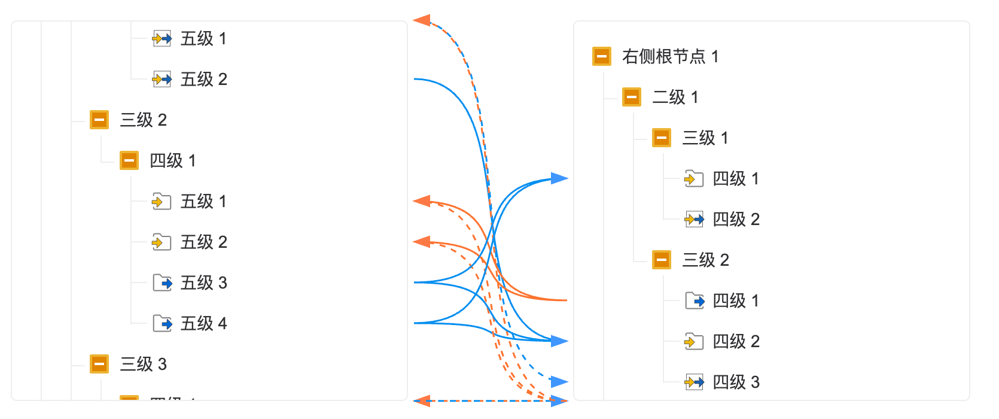

# Double Tree Flow

一个功能强大、灵活的用于可视化两棵树之间节点连接关系的JavaScript库。适用于流程图、决策树、数据映射等多种场景。

## 预览截图



## 功能特点
- 支持左右两棵树之间的节点连接可视化
- 节点展开/折叠功能，支持递归展开和层级控制
- 自动计算和绘制连接线，支持贝塞尔曲线和直线两种连接方式
- 智能处理节点滚动和可视性，优化连接线显示
- 响应式设计，适应不同窗口大小
- 支持自定义节点样式、连接线样式
- 支持节点拖拽功能
- 提供丰富的事件回调接口
- 支持节点文本背景色显示控制
- 支持节点类型区分（输入/输出/输入输出）及对应图标显示

## 安装

### 使用npm
```bash
npm install double-tree-flow --save
```

### 使用yarn
```bash
yarn add double-tree-flow
```

### 直接引入
```html
<script src="https://unpkg.com/double-tree-flow/dist/index.umd.js"></script>
<link rel="stylesheet" href="https://unpkg.com/double-tree-flow/dist/index.css">
```

## 使用示例

```javascript
// 导入库
import DoubleTreeFlow from 'double-tree-flow';
import 'double-tree-flow/dist/index.css';

// 准备数据
const leftTreeData = [
    {
        id: 'left-1',
        label: '节点1',
        level: 1,
        icon: 'icon.png'
        children: [
            {
                id: 'left-1-1',
                label: '子节点1-1',
                level: 2,
                type: 'input',
                icon: 'icon.png'
            },
            {
                id: 'left-1-2',
                label: '子节点1-2',
                level: 2,
                icon: 'icon.png',
                children: [
                    {
                        id: 'left-1-2-1',
                        label: '子节点1-2-1',
                        level: 3,
                        type: 'output',
                        icon: 'icon.png'
                    }
                ]
            }
        ]
    },
    {
        id: 'left-2',
        label: '节点2',
        level: 1,
        icon: 'icon.png',
        type: 'input'
    }
];

const rightTreeData = [
    {
        id: 'right-1',
        label: '节点A',
        level: 1,
        icon: 'icon.png',
        children: [
            {
                id: 'right-1-1',
                label: '子节点A-1',
                level: 2,
                icon: 'icon.png'
            }
        ]
    },
    {
        id: 'right-2',
        label: '节点B',
        level: 1,
        icon: 'icon.png'
    },
    {
        id: 'right-3',
        label: '节点C',
        level: 1,
        icon: 'icon.png'
    }
];

const linkList = [
    { source: 'left-1', target: 'right-1', id: '1' },
    { source: 'left-1-1', target: 'right-1-1', id: '2' },
    { source: 'left-2', target: 'right-2', id: '3' },
    { source: 'left-1-2-1', target: 'right-3', id: '4' }
];


// 创建实例
// 在HTML中准备一个容器元素
// <div id="double-tree-container" data-treeWidth="300" data-treeHeight="200"></div>


const treeFlow = new DoubleTreeFlow('double-tree-container', leftTreeData, rightTreeData, linkList, {
  bezier: 100,
  enableLink: true,
  enableTxtBgColor: true
});

// 方法调用
// 重绘连接线
treeFlow.redraw();

// 更新数据
treeFlow.updateData(newLeftTreeData, newRightTreeData, newLinkList);
```

## API文档

### 注意事项
  1. 树节点数据必须包含`id`、`label`和`level`属性。 
    【id以left-或right-开头】
  2. 连接线数据必须包含`source`和`target`属性，对应树节点的`id`。
  3. 树节点数据可以包含`icon`属性，用于显示节点图标。
  4. 树节点数据可以包含`type`属性，用于区分节点类型（'input' | 'output' | 'inOut'），对应不同图标显示
  5. 构造函数可以接受一个可选的配置对象，用于自定义行为和样式。

### DoubleTreeFlow类

#### 构造函数
```typescript
constructor(containerId: string, leftTreeData: TreeNode[], rightTreeData: TreeNode[], linkList: Connection[], options: { bezier?: number; enableLink?: boolean; enableTxtBgColor?: boolean; onConnectionsChange?: (connections: Connection[]) => void; onConnectionChange?: (connection: Connection, type: 'add' | 'remove') => void; onUpdateConnection?: (connection: Connection) => void } = {})
```
- `containerId`: 容器元素的ID
- `leftTreeData`: 左侧树的数据
- `rightTreeData`: 右侧树的数据
- `linkList`: 初始连接线列表
- `options`: 配置选项，包含：
  - `bezier`: 贝塞尔曲线控制点偏移量
  - `enableLink`: 是否启用连接线
  - `enableTxtBgColor`: 是否启用节点文本背景色显示
  - `onConnectionsChange`: 连接线列表变化时的回调函数
  - `onConnectionChange`: 单个连接线添加或删除时的回调函数
  - `onUpdateConnection`: 单个连接线更新时的回调函数

#### 方法
- `redraw()`: 重绘连接线
- `updateData(leftTreeData: TreeNode[], rightTreeData: TreeNode[], linkList: Connection[])`: 更新树数据和连接线
- `updateConnection(updatedConnection: Connection)`: 更新指定连接的数据，必须包含id以标识要更新的连接

### 数据类型

```typescript
// 树节点接口
interface TreeNode {
  id: string;
  label: string;
  level: number;
  icon?: string;
  type?: 'input' | 'output' | 'inOut'; // 节点类型，可选
  children?: TreeNode[];
  parentId?: string;
}

// 连接接口
interface Connection {
  source: string;
  target: string;
  id?: string;
  [key: string]: any; // 允许添加其他自定义属性
}
```

## 开发

### 安装依赖
```bash
npm install
```

### 开发模式
```bash
npm run dev
```

### 构建生产版本
```bash
npm run build
```

### 运行测试
```bash
npm run test
```

## 常见问题

### 1. 如何自定义节点样式？
可以通过CSS覆盖默认样式，或者在创建实例时提供自定义样式函数。

### 2. 如何处理大量节点的性能问题？
对于大量节点，建议使用虚拟滚动技术，或者考虑分页加载节点数据。

### 3. 是否支持移动端？
是的，库采用响应式设计，支持移动端触摸操作。

## 许可证
MIT

## 贡献
欢迎提交 issue 和 pull request 来改进这个库。